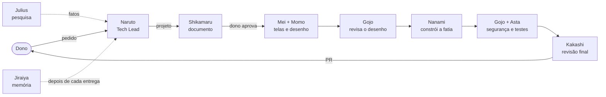

<p align="center">
  
</p>

<h1 align="center">🍥 Konoha Inc.</h1>

<p align="center">
  <b>Uma empresa de desenvolvimento de software feita de agentes do Claude Code.</b><br>
  O dono fala com uma pessoa só. A vila inteira trabalha por trás.
</p>

---

## A ideia

Numa conversa única, com um pedido de várias camadas, o agente se perde e entrega tudo "meia bomba". A Konoha resolve isso do jeito que uma empresa de verdade resolve: **cada um faz uma coisa, bem feita, e alguém coordena.**

- O dono não é programador. Ele decide **o quê** e **se vai para o ar**. O resto é com a vila.
- **Uma coisa por vez na mesa do dono.** Os agentes trabalham muito nos bastidores; o que chega até ele é pouco, na hora certa, com o mapa de onde estamos.
- **Nada é aceito pelo relato.** Todo "pronto" é conferido contra a mudança real.
- **Sempre termina em PR.** Ninguém publica direto; o dono junta.

## A vila

| | Quem | Papel | O que faz |
|---|---|---|---|
| 🍥 | **Naruto Uzumaki** | Tech Lead · Hokage | A única porta de entrada do dono. Entende o pedido, divide no tamanho certo, lança os clones das sombras (os outros agentes) e confere cada entrega. Não constrói. |
| 🦌 | **Shikamaru Nara** | Product Owner | Escreve o documento de projeto: o problema como uma história real, a solução em linguagem simples, o que fica de fora. |
| 📜 | **Julius Novachrono** | Pesquisador | Traz fatos com fonte, sem opinar. Uma pergunta por chamada. |
| 🎨 | **Mei Hatsume** | Designer | Como as telas funcionam e parecem: fluxo, estados, textos, casos extremos. |
| 🏛️ | **Momo Yaoyorozu** | Arquiteta | O desenho técnico da feature inteira, do banco à tela, dividido em fatias de ponta a ponta. |
| 🕶️ | **Kento Nanami** | Implementador | Constrói uma fatia por vez, teste antes do código, prova antes de dizer pronto. Hora extra, não. |
| 👁️ | **Satoru Gojo** | Security | Acha furos com cenário concreto de ataque e diz como fechar. No desenho, na mudança e no produto. |
| ⚔️ | **Asta** | Testes | O olhar de fora: quebra o código de propósito para ver se os testes percebem, testa como usuário de outra empresa, com dado sujo e fuso de Brasília. |
| 📖 | **Kakashi Hatake** | Revisor | O último portão antes do dono. Lê o código pronto: faz o que o desenho pediu? segue as regras da casa? |
| 🐸 | **Jiraiya** | Docs | A memória escrita da vila: o porquê das coisas, com cada afirmação conferida contra o código. |

## Como um pedido anda



Conserto pontual pula o documento. Pergunta vai direto ao Pesquisador. Emergência corre por fora da fila.

## O que tem aqui

| Pasta | O quê |
|---|---|
| [`agentes/`](agentes) | Os dez agentes, um arquivo cada, no formato de subagente do Claude Code |
| [`protocolos/`](protocolos) | As regras que valem para todos: comunicação, avisos ao dono, casos extremos, a referência do Tech Lead |
| [`guias/`](guias) | Guias por tecnologia (banco/Supabase, React, n8n) |
| [`modelos/`](modelos) | Modelos de documento de projeto, manual de estilo e overclock |
| [`hooks/`](hooks) | O que não depende de o agente lembrar (abaixo) |
| [`pesquisa/`](pesquisa) | A pesquisa que deu origem a cada agente. Ela cita às vezes o conjunto de agentes que serviu de ponto de partida e os casos reais de um projeto; esse material não está aqui |

## Regra escrita falha. Mecanismo segura.

A lição mais cara da vila: agente esquece regra, mesmo explícita. O que importa de verdade vira **gancho** do Claude Code, que roda sozinho:

- **🔒 Trava do banco** ([`proteger-banco.py`](hooks/proteger-banco.py)): leitura livre; gravação direta bloqueada; mudança em produção só com o "pode" do dono, com a pergunta **traduzida para português** e ⚠️ no que apaga dados ou abre acesso ([`traduzir.py`](hooks/traduzir.py)).
- **📋 Quadro do Linear** ([`quadro-linear.py`](hooks/quadro-linear.py)): toda conversa começa sabendo o que está andando e em qual outra conversa, e fica sabendo quando algo muda lá fora. Tarefa pega por uma conversa fica travada com o nome dela.
- **🗂️ Barra lateral** ([`barra-lateral.py`](hooks/barra-lateral.py)): a conversa com tarefa não termina a resposta com a barra desatualizada. Título com o assunto, grupo com o andamento, e `Sua vez` quando está esperando o dono.
- **🧹 Limpeza** ([`limpeza-git.py`](hooks/limpeza-git.py)): PR juntado não deixa pasta de trabalho nem branch para trás, no computador e no GitHub. Só apaga o que tem certeza de estar na versão principal e sem trabalho pendente.
- **🧪 Testes e replay**: cada gancho tem teste, e o [`replay-trava.py`](hooks/replay-trava.py) roda a trava nas chamadas reais das conversas antes de qualquer mudança, para ela não encher o dono de perguntas.

## Instalar

Os agentes são lidos de `~/.claude/agents`, e os protocolos de `~/.claude/empresa-agentes`. No Windows, sem permissão de administrador:

```powershell
cmd /c mklink /J "$env:USERPROFILE\.claude\agents" "<pasta do projeto>\agentes"
cmd /c mklink /J "$env:USERPROFILE\.claude\empresa-agentes" "<pasta do projeto>"
```

Depois, no projeto onde a vila vai trabalhar:

- `.claude/settings.local.json` (fora do git, é seu): `{ "agent": "tech-lead" }`
- `.claude/konoha.json` (no git do projeto): o que a vila precisa saber dele.

```json
{
  "linear_time": "Nome do time no Linear",
  "n8n_hosts": ["dominio-do-seu-n8n.com.br"],
  "docs": "docs/konoha",
  "publicar_funcao": "npm run publicar:funcao -- {nome}"
}
```

**A Konoha não guarda nada de cliente.** O que a vila aprende num projeto (casos reais, furos achados, lições com nome) fica na pasta `docs` do próprio projeto; aqui só entra o que vale para qualquer um.

Os ganchos entram em `~/.claude/settings.json` (veja o topo de cada arquivo em `hooks/`). O do Linear precisa da variável `LINEAR_API_KEY`.

---

<p align="center"><i>"Eu não volto atrás na minha palavra. Esse é o meu jeito ninja."</i><br>— e o PR fica para o dono juntar.</p>
